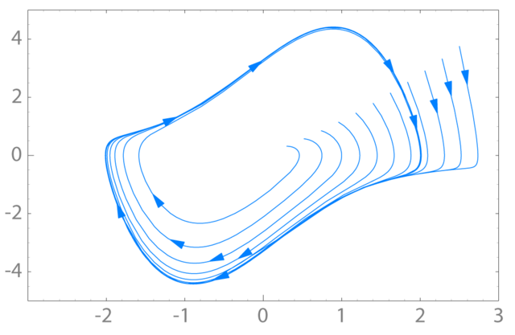

---
jupytext:
  text_representation:
    extension: .md
    format_name: myst
    format_version: 0.13
    jupytext_version: 1.19.5
kernelspec:
  display_name: Python 3
  language: python
  name: python3
---

# Week 10 - Chaotic Dynamics

+++

[Chaos theory](https://en.wikipedia.org/wiki/Chaos_theory) is a branch of science that focuses on the study of systems that exhibit chaotic behavior. These systems are quite sensitive to their initial conditions, meaning that small changes or even errors in measurements can lead to vastly different outcomes. These systems tend have strange couplings and feedback loops, making them very difficult to predict. These systems are nonlinear, meaning that the mathematical tools we bring to bear are often more sophisticated. And, computing is often required to simulate and understand the behavior of these systems.

We will focus on classical chaos, where the systems are [deterministic](https://en.wikipedia.org/wiki/Deterministic_system); they follow specific laws or equations. There is no inherent randomness included in the system. In some cases, folks include [noise](https://en.wikipedia.org/wiki/Noise_(electronics)) in their system, but this is not required for a system to be chaotic. Even though they are fully deterministic, due to their sensitivity to initial conditions, classical chaotic systems can appear random and unpredictable over time. 

## Characteristics of Chaotic Systems

Chaotic systems exhibit several key characteristics that distinguish them from other types of [dynamical systems](https://en.wikipedia.org/wiki/Dynamical_system)

### Sensitive Dependence on Initial Conditions

One of the hallmark features of chaotic systems is their sensitive dependence on initial conditions. Even tiny differences in the starting state of the system can lead to dramatically different outcomes. While in many cases this means that we cannot predict the long-term behavior of the system, in some cases we can still make accurate short-term predictions. This concept has been abstracted into the popular saying "a butterfly flapping its wings in Brazil can cause a tornado in Texas," illustrating how small changes can have far-reaching effects. But it is true that in weather systems, small changes in atmospheric conditions can result in significantly different weather patterns.

We can see this with a very simple nonlinear map, the [logistic map](https://en.wikipedia.org/wiki/Logistic_map) $x_{n+1} = r x_n (1-x_n)$, a common toy model of chaos. Below we iterate it twice, starting from two initial values that differ by only $0.001$.

```{code-cell} ipython3
:tags: [hide-input]

import numpy as np
import matplotlib.pyplot as plt
plt.style.use('seaborn-v0_8-colorblind')

r = 3.9
n_steps = 60
x1 = np.zeros(n_steps)
x2 = np.zeros(n_steps)
x1[0] = 0.5
x2[0] = 0.5 + 1e-3

for n in range(n_steps - 1):
    x1[n+1] = r * x1[n] * (1 - x1[n])
    x2[n+1] = r * x2[n] * (1 - x2[n])

fig, ax = plt.subplots(figsize=(8, 4))
ax.plot(x1, 'o-', label=r'$x_0 = 0.500$', markersize=4)
ax.plot(x2, 's-', label=r'$x_0 = 0.501$', markersize=4)
ax.set_xlabel('Iteration $n$')
ax.set_ylabel('$x_n$')
ax.set_title('Sensitive Dependence on Initial Conditions (Logistic Map, $r=3.9$)')
ax.legend()
ax.grid(True)
plt.tight_layout()
plt.show()
```

The two trajectories track each other closely at first, but within about 20 iterations they have completely decorrelated, even though the underlying rule and starting values are nearly identical.

### Nonlinearity

Chaotic systems are typically [nonlinear](https://en.wikipedia.org/wiki/Nonlinear_system); simple linear equations and the properties of their solutions are not sufficient to describe their behavior. The couplings of different aspects of the system can lead to feedback loops and interactions that are not simply additive. The mathematical equations governing chaotic systems often involve nonlinear functions, and are thus require different tools to analyze. Moreover, these nonlinear behaviors can change dramatically with small changes in the system parameters. These can lead to [bifurcations](https://en.wikipedia.org/wiki/Bifurcation) in the system, where a small change in a parameter can cause a sudden and qualitative change in the system's behavior. This is just another reason why chaotic systems are so difficult to predict and control

The logistic map above is a classic example of this. If we instead track only the long-term (settled) values of $x_n$ as we slowly vary the growth rate $r$, we get the famous bifurcation diagram below: a single stable value splits ("bifurcates") into two, then four, and so on, eventually giving way to chaos.

```{code-cell} ipython3
:tags: [hide-input]

import numpy as np
import matplotlib.pyplot as plt
plt.style.use('seaborn-v0_8-colorblind')

r_values = np.linspace(2.4, 4.0, 800)
x = np.full_like(r_values, 0.5)
n_iterations = 300
n_last = 100

r_plot, x_plot = [], []
for i in range(n_iterations):
    x = r_values * x * (1 - x)
    if i >= n_iterations - n_last:
        r_plot.append(r_values)
        x_plot.append(x.copy())

r_plot = np.concatenate(r_plot)
x_plot = np.concatenate(x_plot)

fig, ax = plt.subplots(figsize=(9, 6))
ax.plot(r_plot, x_plot, ',k', alpha=0.3)
ax.set_xlabel(r'Growth Rate $r$')
ax.set_ylabel(r'$x_n$ (long-term)')
ax.set_title('Bifurcation Diagram of the Logistic Map')
ax.grid(True)
plt.tight_layout()
plt.show()
```

Notice the period-doubling cascade near $r\approx 3.0$ and $r\approx 3.45$, and the onset of fully chaotic behavior beyond $r\approx 3.57$ (with narrow periodic "windows" still visible inside the chaotic region).

### Strange Attractors

We have seen how systems can have fixed points - both stable and unstable - and we have seen periodic behavior. These are common in many dynamical systems. In our study of the harmonic oscillator, we observed that the system can exhibit periodic behavior when undamped or driven, but we also saw how it can settle to a stable fixed point when damped. As we move to study chaotic systems, we begin to see other kinds of behavior. Systems can have [limit cycles](https://en.wikipedia.org/wiki/Limit_cycle) - periodic orbits that are stable or unstable. Below we show the limit cycle of the [Van der Pol oscillator](https://en.wikipedia.org/wiki/Van_der_Pol_oscillator), 

)


One of the most interesting types of [attractors](https://en.wikipedia.org/wiki/Attractor) in dynamical systems is the [strange attractor](https://en.wikipedia.org/wiki/Strange_attractor). These are fractal structures in phase space towards which the system evolves over time. Strange attractors are complex and often exhibit self-similarity, meaning they look similar at different scales. The [Lorenz attractor](https://en.wikipedia.org/wiki/Lorenz_system) is a famous example of a strange attractor, displaying a butterfly-shaped pattern.

<!--  -->

### Long-term Unpredictability

While chaotic systems can be predictable in the short term, their long-term behavior is inherently unpredictable due to the exponential growth of errors in initial conditions. You can think about this in terms of taking a bundle of trajectories that all start with slightly different initial conditions. As time goes on, these trajectories will diverge from one another; they will do so exponentially in every direction. The rate at which they diverge most rapidly is called the [Lyapunov exponent](https://en.wikipedia.org/wiki/Lyapunov_exponent). Technically, there's an exponent for each direction in phase space, but we often just refer to the largest one. If the largest Lyapunov exponent is positive, then the system is chaotic. 

We can see this "exponential growth of errors" directly by tracking the separation between the two logistic-map trajectories from earlier, but now starting them only $10^{-8}$ apart and plotting their separation on a logarithmic axis.

```{code-cell} ipython3
:tags: [hide-input]

import numpy as np
import matplotlib.pyplot as plt
plt.style.use('seaborn-v0_8-colorblind')

r = 3.9
n_steps = 40
x1 = np.zeros(n_steps)
x2 = np.zeros(n_steps)
x1[0] = 0.5
x2[0] = 0.5 + 1e-8

for n in range(n_steps - 1):
    x1[n+1] = r * x1[n] * (1 - x1[n])
    x2[n+1] = r * x2[n] * (1 - x2[n])

divergence = np.abs(x1 - x2)

fig, ax = plt.subplots(figsize=(8, 4))
ax.semilogy(divergence, 'o-')
ax.set_xlabel('Iteration $n$')
ax.set_ylabel(r'$|x_n - x_n^\prime|$')
ax.set_title('Exponential Divergence of Nearby Trajectories')
ax.grid(True, which='both')
plt.tight_layout()
plt.show()
```

The straight-line growth on this log scale is the signature of a positive Lyapunov exponent: the separation grows like $e^{\lambda n}$ until it saturates once the trajectories are as far apart as the attractor itself allows.

+++
