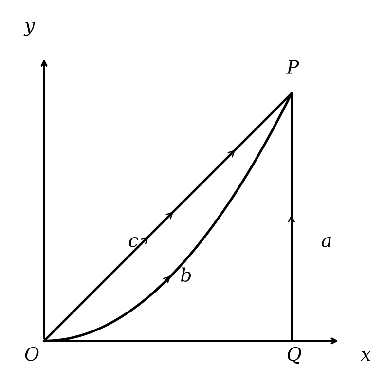

---
jupytext:
  text_representation:
    extension: .md
    format_name: myst
    format_version: 0.13
    jupytext_version: 1.19.5
kernelspec:
  display_name: Python 3
  language: python
  name: python3
---

+++ {"editable": true}

<!-- HTML file automatically generated from DocOnce source (https://github.com/doconce/doconce/)
doconce format html hw4.do.txt --no_mako -->
<!-- dom:TITLE: PHY321: Classical Mechanics 1 -->

+++ {"editable": true}

# Homework 4

Total points: **100**.

+++ {"editable": true}

## Introduction to Homework 4

This homework's sets of classical pen and paper and computational
exercises deal with some motion problems and conservation of energy. We also have a preparation exercise for the upcoming midterms and final project.

The relevant reading background is
1. chapters 3, 4.1, 4.2 and 4.3 of Taylor (there are many good examples there) and

2. chapters 10-13 of Malthe-Sørenssen.

3. for the numerical exercise see Malthe-Sørenssen section 7.5

In both textbooks there are many nice worked out examples. Malthe-Sørenssen's text contains also several coding examples you may find useful. 

The numerical homework focuses on another motion problem where you can
use the code you developed in homework 3, almost entirely. Please take
a look at the posted solution (jupyter-notebook) for homework 3 (**POSTED AFTER HW3 DUE**). You
need only to change the forces at play. The numerical problem this time is based
on your code from homework 3 and we will try to make the motion of a falling object in two dimensions more realistic by allowing to bounce up again due to a normal force from the floor.

### Practicalities about homeworks and projects

1. You can work in groups (optimal groups are often 2-3 people) or by yourself. If you work as a group you can hand in one answer only if you wish. **Remember to write your name(s)**!

2. Homeworks are available ten days before the deadline.

3. Submission instructions: Submit the paper-and-pencil exercises as a **single scanned PDF document**. For this homework, this applies to exercises 1–5. Convert the Jupyter notebook to a **PDF** and attach it to the same PDF document.

+++

### Exercise 1 (15 pts), Is this a conservative force?

Consider a particle of mass $m$ moving in two dimensions. The particle moves from $(0,0)$ to $(1,1)$ along three different paths, $a$, $b$ and $c$ as shown in the figure below. 



In this space, the particle experiences a force:

$$\vec{F} = \langle x^2, 2xy \rangle = x^2\hat{i} + 2xy \hat{j}$$

* 1a (3pt) Calculate the work done by the force along path $a$, which is a straight line from $(0,0)$ to $(1,0)$, and then to $(1,1)$. *Break the path into two segments and calculate the work done along each segment separately.*
* 1b (3pt) Calculate the work done by the force along path $b$, which follows the function $y = x^2$ from $(0,0)$ to $(1,1)$.
* 1c (4pt) Calculate the work done by the force along path $c$, which is given parametrically by $x = t^3$ and $y = t^2$ from $(0,0)$ to $(1,1)$.
* 1d (5pt) Is this force conservative? Explain your answer in at least two ways.

+++ {"editable": true}

### Exercise 2 (10 pt), Sliding puck

A small puck rests on a fixed sphere of radius $R$. The puck is given a tiny nudge and it slides down the sphere. Using conservation of energy, we can determine the point at which the puck leaves the sphere.

```{code-cell} ipython3
import numpy as np
import matplotlib.pyplot as plt
plt.style.use('seaborn-v0_8-colorblind')

R = 1.0
theta = np.radians(35)  # an arbitrary illustrative angle, not the answer

fig, ax = plt.subplots(figsize=(5, 5))
phi = np.linspace(0, 2 * np.pi, 200)
ax.plot(R * np.cos(phi), R * np.sin(phi), 'C0')

px, py = R * np.sin(theta), R * np.cos(theta)
ax.plot(px, py, 'C1o', markersize=10, label='Puck')
ax.plot([0, px], [0, py], 'k--', lw=1)
ax.plot([0, 0], [0, R], 'k:', lw=1)
ax.annotate(r'$\theta$', xy=(0.15, 0.75), fontsize=13)
ax.plot(0, 0, 'ks', markersize=5)

ax.set_xlim(-1.3, 1.3)
ax.set_ylim(-1.3, 1.3)
ax.set_aspect('equal')
ax.set_title('Puck sliding on a sphere (setup sketch)')
ax.set_xlabel('x')
ax.set_ylabel('y')
ax.grid(True)
plt.tight_layout()
plt.show()
```

* 2a (3pt) Setup the problem with a sketch. Explain the setup and include any assumptions that you need to make in order to solve the problem analytically. Identify the height as a function of the polar angle, $h(\theta)$. What is the maximum possible angle $\theta$ that the puck could reach before falling off? Why?
* 2b (2pt) Use conservation of energy to find the speed of the puck as a function of its height. Your answer should be in terms of the polar angle, $\theta$.
* 2c (3pt) Use Newton's second law to find the normal force acting on the puck as a function of its height. Your answer should be in terms of the polar angle, $\theta$. What is the condition for the puck to leave the sphere?
* 2d (2pt) At what angle and height does the puck leave the sphere? 

+++ {"editable": true}

### Exercise 3 (10pt), Example of potential

Consider a particle of mass $m$ moving according to the potential:

$$
V(x,y,z)=A\exp\left\{-\frac{x^2+z^2}{2a^2}\right\}.
$$

We can think of this potential as the energy landscape of a particle in three dimensions. That is, you can imagine a particle moving around this potential like a ball rolling around a landscape. That analogy is not perfect, but it is a good way to help us think about stability and equilibrium.

* 3a (2pt) Plot this potential or sketch a plot of it. You can use perspective plots, contour plots or any other plot you find useful.
* 3b (2pt) What are some features you notice in this potential? What happens when you change $A$ and $a$? Consider both signs of $A$, or state the sign you assume.
* 3c (2pt) Imagine a particle moving in this potential, what are some expected trajectories?
* 3d (2pt) Do there appear to be any equilibrium points? If so, are they stable or unstable?
* 3e (2pt) Is the resulting force conservative? Why?

+++ {"editable": true}

### Exercise 4 (15pt), forces  and potentials

A particle of mass $m$ has velocity $v=\alpha/x$, where $x$ is its displacement.

* 4a (5pt) Find the force $F(x)$ responsible for the motion. State any assumptions about the domain and direction of motion.

A particle is thereafter under the influence of a force $F=-kx+kx^3/\alpha^2$, where $k$ and $\alpha$ are constants and $k$ is positive.

* 4b (5pt) Determine the potential $U(x)$ and discuss the motion. It can be convenient here to make a sketch/plot of the potential as a function of $x$.

* 4c (5pt) What happens when the energy of the particle is $E=(1/4)k\alpha^2$? Hint: what is the maximum value of the potential energy?

+++

### Exercise 5 (10pt), Midterms and Final Project Preparation

Your final project will be a [computational essay](https://arxiv.org/abs/1909.12697) of your own design. The idea is informed by a proposal by [Stephen Wolfram](https://www.stephenwolfram.com/). In his [original post](https://writings.stephenwolfram.com/2017/11/what-is-a-computational-essay), Wolfram talks about the importance of the computational medium as a way of communicating science. 

In this homework question, we are going to start building your plan for your computational essay. I ask that you complete this particular homework problem by yourself because it is important for each of you to do this planning.

To get started, you should read the following articles; they are not very long:

1. Wolfram's [What is a Computational Essay?](https://writings.stephenwolfram.com/2017/11/what-is-a-computational-essay)
2. The short paper [Computational Essays: An Avenue for Scientific Creativity in Physics](https://arxiv.org/abs/1909.12697)
3. Wolfram's [Steps to Writing a Computational Essay](https://www.wolframcloud.com/obj/Expositions/Published/ComputationalEssayGuidelines)

You are, of course, welcome to read more, but these are the three that I would like you to read.

* 5a (3pt) Write a summary of your readings. What did you learn? What was important? What did you find interesting? What questions do you still have? Full credit will be given for a summary that is at least 250 words long.

Computational essays are a new way to communicate your science. It might be a good idea to look at some examples. Review the [University of Oslo's Computational Essay Showroom](https://uio-ccse.github.io/computational-essay-showroom). 

* 5b (3pt) Find at least one computational essay in the [showroom](https://uio-ccse.github.io/computational-essay-showroom) that you find interesting. Write a summary of the computational essay. What did you like? What did you not like? What was interesting about it? What questions do you still have? Full credit will be given for a summary that is at least 250 words long.

These essays were made by students who were taking a course at the University of Oslo. The essays are not meant to be perfect, they are meant to be representative of the work that students can do.

* 5c (3pt) Evaluate the computational essay based on your readings in 5a. How well does the computational essay follow the concept of physics computational literacy, or the guidelines for a good essay? What are the strengths and weaknesses of the computational essay? Full credit will be given for a summary that is at least 250 words long.

Now, let's move to your future plans. 

* 5d (1pt) Write a short paragraph about the things you are interested in studying for your computational essay. This can be a very short paragraph, but it should include at least one image or plot that you find interesting. This can be starting from the homework, the samples in the showroom, or something else entirely.

+++ {"editable": true}

### Exercise 6 (40pt), Bouncing object

This exercise builds on the code you wrote for solving homework 3.
We recommend strongly that you study the text of Malthe-Sørenssen, section 7.5.

In homework 3 we introduced gravity and air resistance and studied their
effects via a constant acceleration due to gravity and the force
arising from air resistance. But what happens when the ball hits the
floor? What if we would like to simulate the normal force from the
floor acting on the ball?  This exercise shows how we can include more
complicated forces with no pain! And the force we include here is an
example of a case where analytical solutions may either be difficult
to find or we cannot find an analytical solution at all.

We need then to include a force model for the normal force from the
floor on the ball. The simplest approach to such a system is to
introduce a contact force model represented by a spring model.  We
model the interaction between the floor and the ball as a single
spring. But the normal force is zero when there is no contact. Here we
define a simple model that allows us to include such effects in our
models.

Assume that $y$ increases upward. The normal force from the floor on the ball is represented by a spring force. This
is a strong simplification of the actual deformation process occurring at the contact
between the ball and the floor due to the deformation of both the ball and the floor.

The deformed region corresponds roughly to the region of **overlap** between the
ball and the floor. The depth of this region is $\Delta y = R-y(t)$, where $R$
is the radius of the ball. This is supposed to represent the compression of the spring.
Our model for the normal force acting on the ball is then

+++ {"editable": true}

$$
\vec{N} = k (R-y(t)) \vec{e}_y.
$$

+++ {"editable": true}

The normal force must act upward when $y < R$,
hence the sign is positive for an upward-pointing $\vec e_y$.
However, we must also ensure that the normal force only acts when the ball is in
contact with the floor, otherwise the normal force is zero. The full form of the
normal force is therefore

+++ {"editable": true}

$$
\vec{N} = k (R-y(t)) \vec{e}_y,
$$

+++ {"editable": true}

when $y(t) < R$ and zero when $y(t) \ge R$.
In the numerical calculations you can choose $R=0.1$ m and the spring constant $k=1000$ N/m.

```{code-cell} ipython3
import numpy as np
import matplotlib.pyplot as plt
plt.style.use('seaborn-v0_8-colorblind')

R = 0.1
k = 1000.0
y = np.linspace(0, 0.2, 400)
N = np.where(y < R, k * (R - y), 0.0)

fig, ax = plt.subplots(figsize=(6, 4.5))
ax.plot(y, N, 'C0')
ax.axvline(R, color='k', ls='--', lw=1, label=f'$y=R={R}$ m')
ax.set_xlabel('Height of ball center, $y$ (m)')
ax.set_ylabel('Normal force magnitude, $N$ (N)')
ax.set_title('Spring Model of Floor Normal Force vs. Height')
ax.legend()
ax.grid(True)
plt.tight_layout()
plt.show()
```

* 6a (10pt) Identify the forces acting on the ball and set up a diagram with the forces acting on the ball. Find the acceleration of the falling ball now with the normal force as well.

* 6b (30pt) Choose a large enough final time so you can study the ball bouncing up and down several times. Add the normal force and compute the height of the ball as function of time with and without air resistance. Comment your results.
